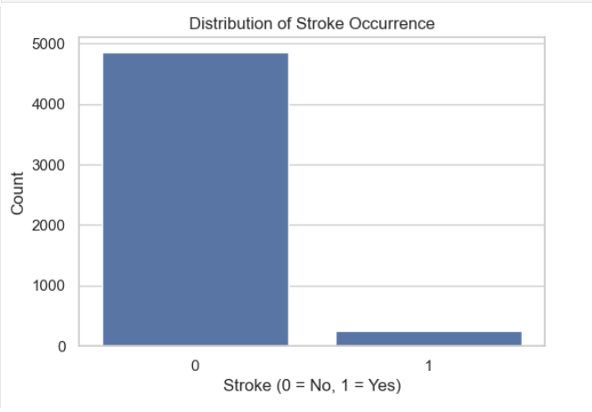

# Machine Learning with Python Labs
## Shahid Salim

### Stroke Prediction Analysis Report

Git-hub repository at:
https://github.com/ShahidSalim-oss/PythonMLLabs.git 

- Jupyter notebook: **stroke.ipynb**
- data set: data\stroke_data.csv


This project involves analyzing health and demographic data to predict stroke occurrences using machine learning techniques. The goal is to identify key factors that contribute to stroke risk and apply predictive models to assist in early diagnosis and prevention.

# Table of Contents

- [Overview](#overview)
- [Installation](#installation)
- [Data Overview](#data-overview)
- [Exploratory Data Analysis](#exploratory-data-analysis)
- [Feature Engineering](#feature-engineering)
- [Train-Test Split](#train-test-split)
- [Machine Learning Model](#machine-learning-model)
- [Model Evaluation](#model-evaluation)
- [Docker Setup](#docker-setup)
- [Conclusion](#conclusion)

# Overview

This project focuses on utilizing data science techniques to analyze stroke data. The dataset contains key features such as age, hypertension status, heart disease, and lifestyle habits, among others, to predict whether an individual is at risk of stroke. The primary model used for this analysis is a **Random Forest Classifier**.

Key tasks include:
- Data Preprocessing
- Exploratory Data Analysis (EDA)
- Feature Engineering
- Model Training and Evaluation

# Installation

To reproduce the analysis, ensure you have the following Python packages installed:

```bash
pip install -r requirements.txt
```

# Data Overview
The dataset consists of several health-related variables. The target variable in this analysis is whether or not a person has had a stroke. Below are the key columns in the dataset:

1. Age
2. Gender
3. Hypertension
4. Heart Disease
5. Ever Married
6. Work Type
7. Residence Type
8. Average Glucose Level
9. BMI
10. Smoking Status
11. Stroke (Target variable)

We load the data and perform some basic exploration to understand the structure and contents:


# Exploratory Data Analysis

### Missing Values:
We identified that there were missing values in the BMI feature, which we handled appropriately by removing the missing rows.


### Outlier Detection
We examine potential outliers in the age and avg_glucose_level columns using boxplots.


### Distribution of Stroke Cases:
We explored the distribution of stroke cases in the dataset to get a sense of class imbalance, if any.



### Age Distribution:
We also explored the distribution of age across the dataset.


### Correlation Heatmap:
Next, we generated a correlation matrix to explore relationships between the features.


# Feature Engineering
In this section, we performed encoding of categorical variables using LabelEncoder to convert the categorical features into numerical format. The encoded features included gender, marital status, work type, residence type, and smoking status.


# Train-Test Split

We performed a train-test split to divide the data into training and testing sets, with 20% of the data reserved for testing. We also stratified the target variable to ensure balanced class distribution between the training and test sets.


# Machine Learning Model

### Random Forest Classifier
We implemented the Random Forest classifier to predict stroke occurrences. The Random Forest model is a robust ensemble method that uses multiple decision trees to improve prediction accuracy.


# Model Evaluation 

We evaluated the Random Forest model using key metrics such as accuracy, precision, recall, ROC AUC score, and a classification report. The predicted results were compared to the actual results to assess model performance.


### Confusion Matrix
To visualize the performance of the model, we generated and plotted the confusion matrix.


# Docker Setup
This project can also be run in a Docker container. The following steps explain how to build the Docker image, push it to Docker Hub, and pull it for running the project.

### Step 1: Build the Docker Image
Build the image using the provided Dockerfile:
```bash
docker build -t my12345/stroke-prediction:1.0.0 .
```
### Step 2: Push the Image to Docker Hub
Once the image is built, push it to Docker Hub:
```bash
docker push my12345/stroke-prediction:1.0.0
```
### Step 3: Pull the Image
To use the image on any machine, pull it from Docker Hub:
```bash
docker pull my12345/stroke-prediction:1.0.0
```
### Step 4: Run Jupyter in Docker
To run a Jupyter notebook server inside the Docker container:
```bash
docker run -p 80:8888 my12345/stroke-prediction:1.0.0
```
You can access Jupyter Notebook at http://localhost:80

# Conclusion

In this project, we explored various factors that contribute to stroke risk by analyzing the dataset and building machine learning models. Key insights were gained through exploratory data analysis, which highlighted correlations between age, health conditions, and the likelihood of stroke.

We used the Random Forest classifier to predict stroke occurrences, and the model was evaluated using metrics such as accuracy, precision, recall, and ROC AUC score. The Random Forest model performed reasonably well, demonstrating its effectiveness in predicting stroke based on the provided features.

Future improvements could include:

1. Hyperparameter tuning to further enhance the model's performance.
2. Exploring other advanced machine learning models, such as Gradient Boosting or Neural Networks, for better predictive power.
3. Incorporating external data sources to add more features and improve the model's accuracy.


Overall, the project successfully demonstrated how data analysis and machine learning can be used to predict stroke risks, potentially aiding in early detection and prevention strategies.


